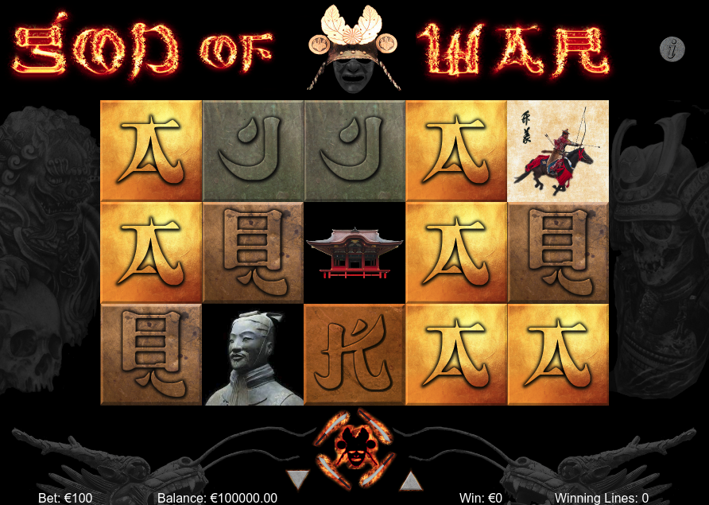

# god-of-war

My first attempt at making slots, God of War is built in vanilla javascript using Canvas.

Start game by typing `node server` in a terminal, or play directly at http://salis010.herokuapp.com/god-of-war

Press the center button at the bottom (the God of War with surrounding swords) to spin the reels. Stake amount can be lowered/increased, and game info can be displayed by pressing the 'i' icon at the top right.

Please do not make use of the graphics since not all can be used for commercial purposes.

The game lacks sound, with the exception of some war drums which are played in case you run out of winning luck after some spins.

Good luck at the reels!
